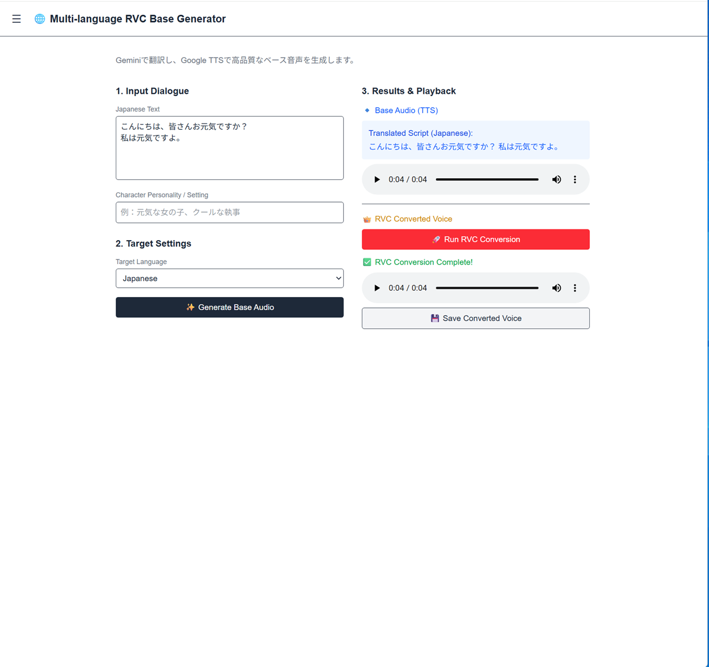
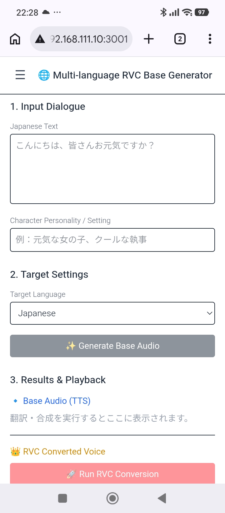
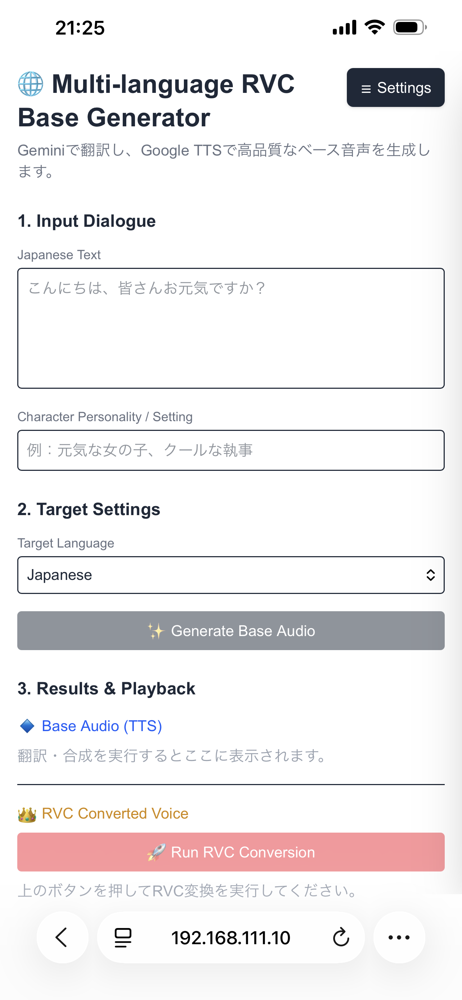

# RVC Multilingual Audio Generator

GeminiによるAI翻訳・台本生成、Google Cloud TTSによる音声合成、RVC (Retrieval-based Voice Conversion) による声質変換を1つのWebアプリで行えるシステムです。

FastAPI（バックエンド）＋ Next.js（フロントエンド）構成で、PC・スマホ・タブレットなど複数デバイスから同時アクセスできます。

## 📸 スクリーンショット

### PC


### Android


### iOS


---

## 📁 プロジェクト構成

```
RVCMultilingual/
├── start.bat             # 起動スクリプト（Windows）
├── .env                  # APIキー管理（要作成）
│
├── core/                 # ビジネスロジック層
│   ├── config.py         # 設定管理
│   ├── constants.py      # 定数（言語マップ等）
│   ├── translator.py     # Gemini翻訳
│   ├── tts_engine.py     # Google Cloud TTS
│   ├── rvc_engine.py     # RVC変換
│   ├── audio_utils.py    # 音声ユーティリティ
│   └── pipeline.py       # パイプライン統合
│
├── backend/              # FastAPI バックエンド
│   ├── main.py           # アプリエントリポイント（ポート8000）
│   ├── job_manager.py    # 非同期ジョブ管理
│   └── routes/           # APIルート
│       ├── translate_tts.py  # POST /api/translate-tts
│       ├── rvc.py            # POST /api/rvc
│       ├── audio.py          # GET /api/audio/{filename}
│       ├── status.py         # GET /api/status/{job_id}（SSE）
│       └── models.py         # GET /api/models
│
├── frontend/             # Next.js フロントエンド（ポート3001）
│   ├── app/page.tsx      # メイン画面
│   ├── components/       # UIコンポーネント
│   └── lib/api.ts        # APIクライアント
│
└── models/               # RVCモデルファイル（.pth / .index）
```

## ⚙️ 初期セットアップ

### 1. Python依存パッケージのインストール

```bash
.\venv\Scripts\activate
pip install -r requirements.txt
```

### 2. Node.js依存パッケージのインストール

```bash
cd frontend
npm install
```

### 3. フロントエンドのビルド

```bash
cd frontend
npm run build
```

### 4. APIキーの設定

プロジェクトルートに `.env` ファイルを作成します。

```env
GEMINI_API_KEY=your_gemini_api_key_here
GOOGLE_APPLICATION_CREDENTIALS=path\to\your\gcp_service_account.json
```

---

## 🚀 起動手順

`start.bat` をダブルクリック（またはコマンドプロンプトで実行）します。

バックエンド（ポート8000）とフロントエンド（ポート3001）の2つのウィンドウが起動します。

### アクセス先

| デバイス | URL |
|:---|:---|
| 同一PC | http://localhost:3001 |
| スマホ・タブレット（同一Wi-Fi） | http://＜PCのLAN IP＞:3001 |

> **PCのLAN IPを調べるには：** コマンドプロンプトで `ipconfig` を実行し、`IPv4 アドレス` を確認してください。

---

## 🔄 コード変更後の反映手順

フロントエンドのコードを変更した場合は、ビルドしてから再起動してください。

```bash
cd frontend
npm run build
```

その後 `start.bat` を再実行します。

---

## 🛑 終了手順

起動した2つのコマンドプロンプトウィンドウをそれぞれ閉じるか、各ウィンドウで `Ctrl + C` を押してください。

---

## 💡 使い方

1. ブラウザで上記URLを開きます
2. 左上の **☰ ボタン** を押してRVC Settings を開き、使用するモデル（.pth）とインデックスファイル（.index）を選択します
3. **1. Input Dialogue** に日本語テキストとキャラクター設定を入力します
4. **2. Target Settings** でターゲット言語を選択します
5. **✨ Generate Base Audio** を押すと翻訳とTTS音声が生成されます
6. **🚀 Run RVC Conversion** を押してRVC声質変換を実行します
7. **💾 Save Converted Voice** で変換済み音声をダウンロードします